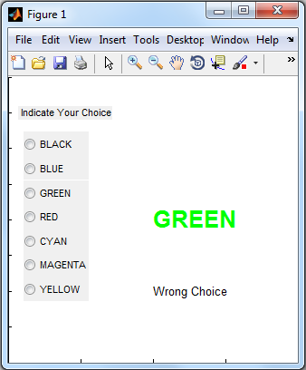
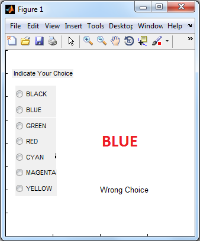

# Paced Stroop Test

MATLAB implementation of Paced Stroop Color-Word Interference Test. This repository provides options to log physiological sensor data synced with each frame of Stroop Test.

This is a timed implementation of Stroop Color-Word Interference Test, where the user can be programmatically paced to take the stroop test and record their response within a time specified by the experimenter. The code generates a MATLAB .mat file containing exact time when the stroop figure was shown, exact time when the user responds along with the color, word and response from each figure.

This project is inspired by a Matlab File Exchange entry on static Stroop Test by George Papazafeiropoulos.

For more details, please check the example file in the html folder which contains function call prototypes and background about the Stroop Color-Word Interference test

This code was developed as a part of a research project that resulted in the following publication, please cite this work if u find it useful:

```
@inproceedings{saha2015towards,  
  title={Towards Incorporating Affective Feedback into Context-Aware Intelligent Environments},  
  author={Saha, Deba Pratim and Martin, Thomas L and Knapp, R Benjamin},  
  booktitle={Affective Computing and Intelligent Interactions, 2015. ACII'15},  
  year={2015}  
}  
```

## User Interface:

The following two screenshots show the congruent and incongruent phases of the PST described above. 
#### Congruent PST: 
When font-color and the word match
#### Incongruent PST: 
When font-color and the word do not match


Congruent PST                     |  Incongruent PST  
:--------------------------------:|:-------------------------:
   |  
